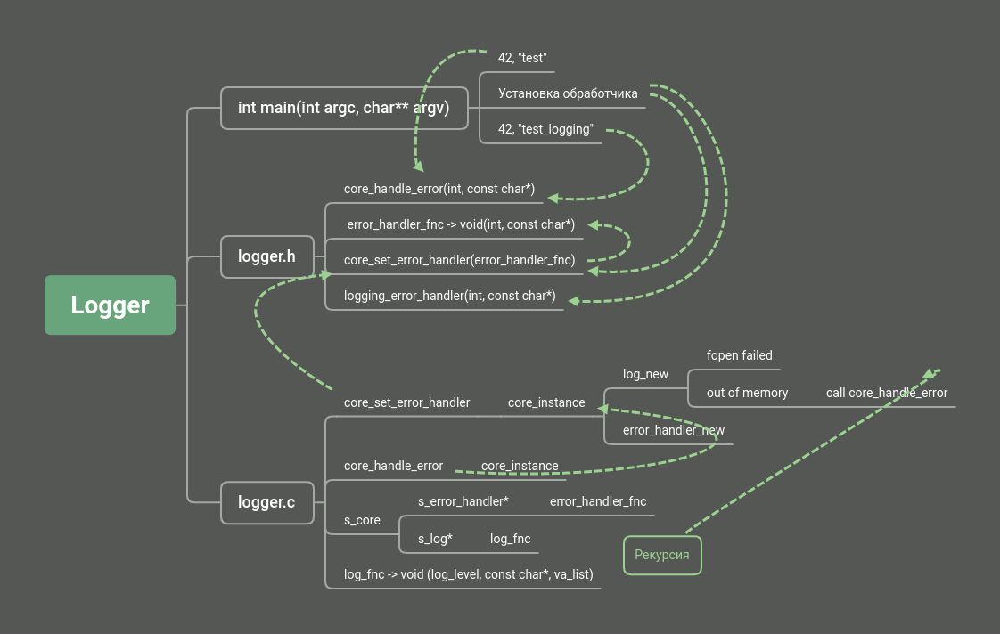

# Learning discrite mathematics


## Requirements

* C++17 compiler
* CMake
* Conan


## Build

```
$ git clone https://github.com/dvetutnev/learn_discrete_math.git
$ cd learn_discrete_math
$ mkdir build && cd build
$ cmake -DCMAKE_BUILD_TYPE=Release ..
$ cmake --build .
$ ctest --verbose
```



